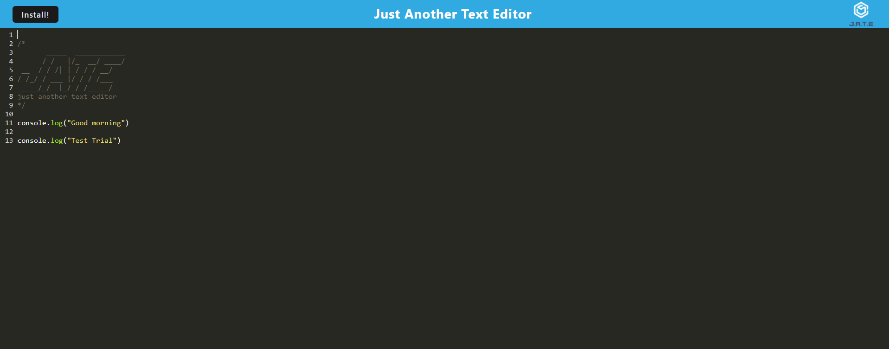

# Text Editor 

## Description
This application is a text editor for creating code snippets. The user can type the code inside the apllication and it will be stored with or without the internet. Also you can click the install button to download the app

## Table of Contents

- [Description](#description)
- [Installation](#installation)
- [License](#license)
- [Screen Capture](#screen-capture)
- [Website Link](#website-link)
- [GitHub Link](#github-repository-link)

## Installation
### 1. Run by the terminal:

#### Go to the root location and npm run install

 

### 2. Run in the website
#### Click install button to install the apps
 

## License
N/A

## Screen Capture

## Website Link
https://assignment19-text-editor.herokuapp.com/
## GitHub Repository Link
https://github.com/timo9939/assignment19
